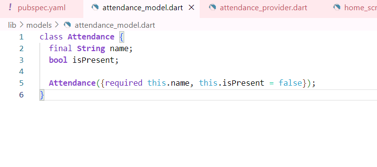
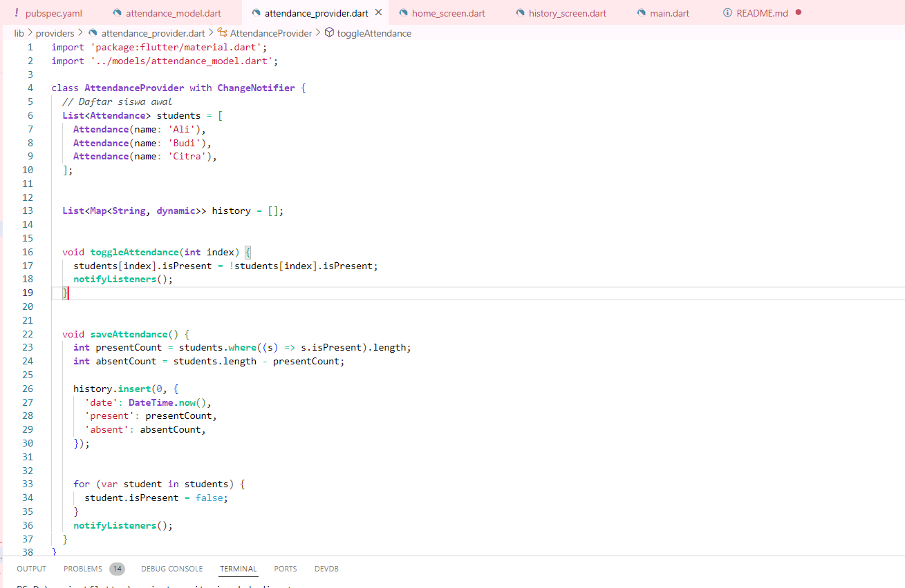
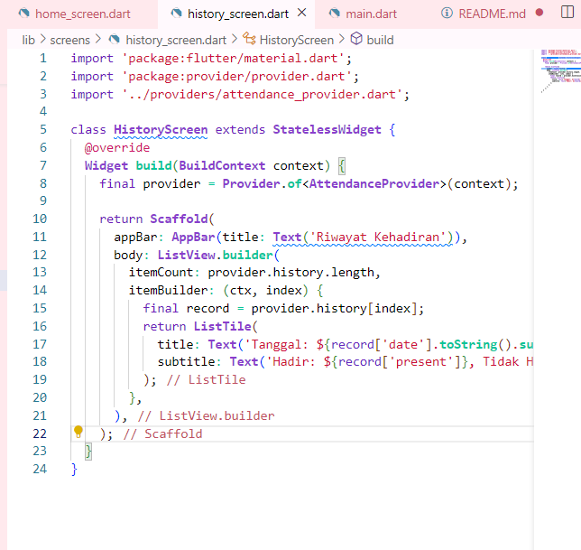
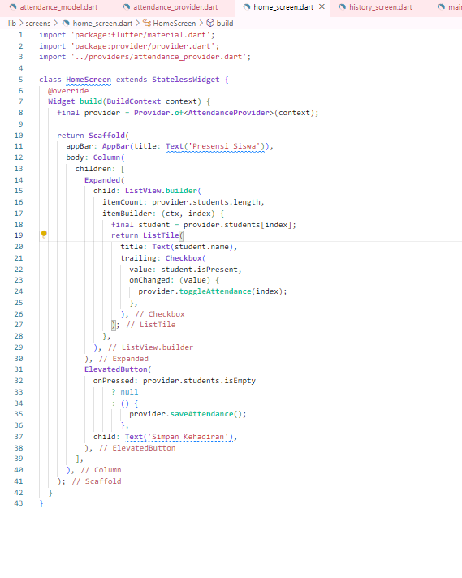
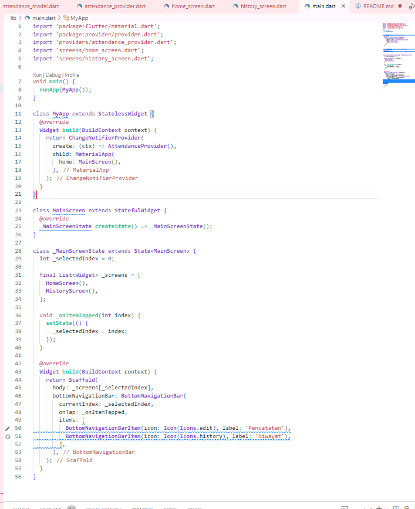
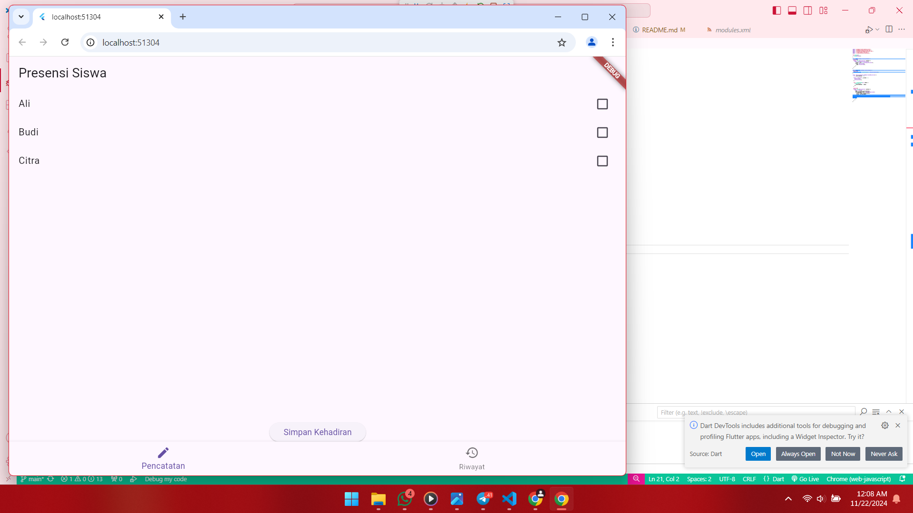

# Nama:Leyla Mona Herlisa Putri
# Kelas: 2b trpl
# nim: 362358302023

final string name :
1. berfungsi untuk properti menyimpan nama siswa
2.Tipe data String
3.Diberi keyword final, artinya nilai properti ini harus di berikan saat pembuatan objek dan tidak bisa di ubah setelahnya

bool isPresesnt:
1.untuk menyimpan status kehadiran (hadir atau tidak hadir)
2.tipe data bool (true/false)
3.Tidak di beri keyword final,artinya nilainya di ubah setelah objek di buat

objek objek kelas ini kemudian daoat di kelola (misalnya, di simpan dalam list)untuk mempermudah pengolahan data siswa secara kolektif

bagian bagian program 
1.impor paket
2.Definisi Kelas
3.Daftar Siswa Awal
4.Riwayat Kehadiran
5.metode Untuk mengubah Kehadiran
6.metode untuk menyimpan kehadiran

struktur tampilan ui:
menampilkan appbar dengan judul ('Riwayat Kehadiran')),
listVIew.builder:
digunakan untuk membuat daftar scrollable berdasarkan jumlah data dalam provider.history
itemCount:Menentukan jumlah elemen yang akan di tampilkan sesuai panjang list history
itemBuilder:fungsi untung membuat setiap item daftar

listTitle:
menampilkan tanggal dari riwayat kehadiran.
record['date']: mengambil tanggal di map di history
.tostring().substring(0,10):format tanggal di ambil hanya bagian "YYY-MM-DD"

metode yang di ambil adalah metode build
mengambil instance dari attendanceProvider yang tersedia di context aplikasi.

hasil program 
ketika dijalan kan,pengguna akan melihat tampilan utama dengan navigasi bawah untuk berpindag antara pencatatan kehadiran dan riwayat kehadiran :
tampilan awal(Pencatatan Kehadiran)
1. tombol pencatatan di BottomNavigationBar aktif
2. halaman menunjukan for, atau daftar untuk mencatat kehadiran dari homescren
 

